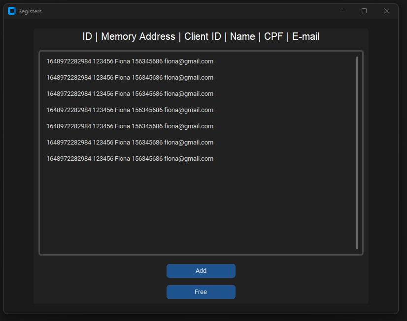
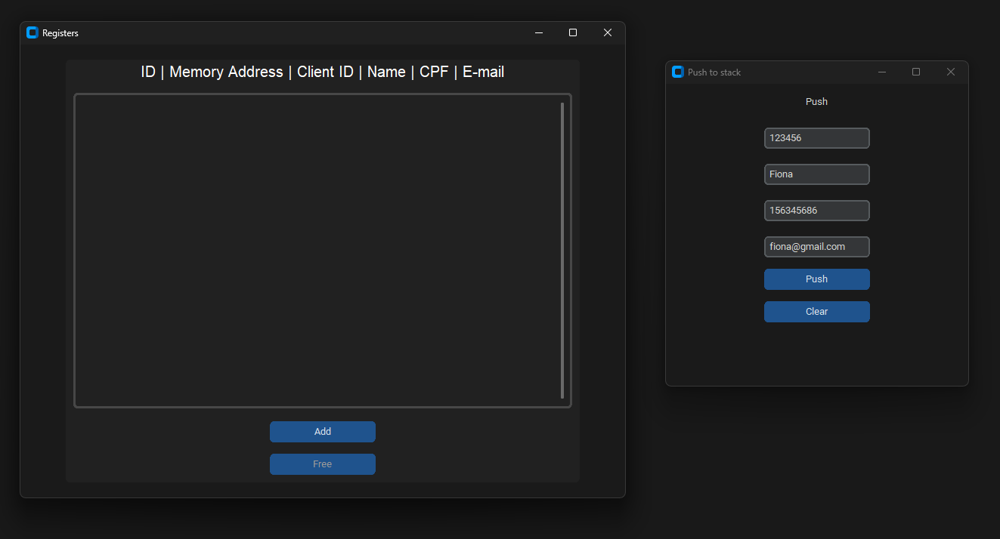

# C/C++ Linked List with UI




---
## To compile main.c (for tests) with his includes:
```
gcc main.c /includes/registration.c /include/utils.h
```

## To compile files and headers to library (.so) to use in python
```
gcc -fPIC -shared -o nameoflib.so nameoffile.c
```
in my case
```
gcc -fPIC -shared -o registration.so .\includes\registration.c .\includes\utils.c
```

## To create an executable (pyinstaller)
```
pyinstaller main.py --onefile --windowed
```